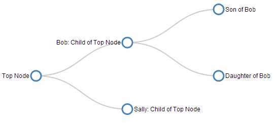

# component-tree: Simple d3.js


Vue project to display simple tree diagrams.
Given a data set the d3 can display a tree diagram using the SVG technology.

## Project setup
```
npm install
```

### Compiles and hot-reloads for development
```
npm run serve
```

### Compiles and minifies for production
```
npm run build
```

### Run your tests
```
npm run test
```

### Lints and fixes files
```
npm run lint
```

### Customize configuration
See [Configuration Reference](https://cli.vuejs.org/config/).

### References
Simple d3.js Tree Diagram with styling, see http://bl.ocks.org/d3noob/8324872. 
Take into a count that the d3 lib version is the v3.5.17. The lib is really different for the v5.

Result:




More documentation in https://d3js.org/